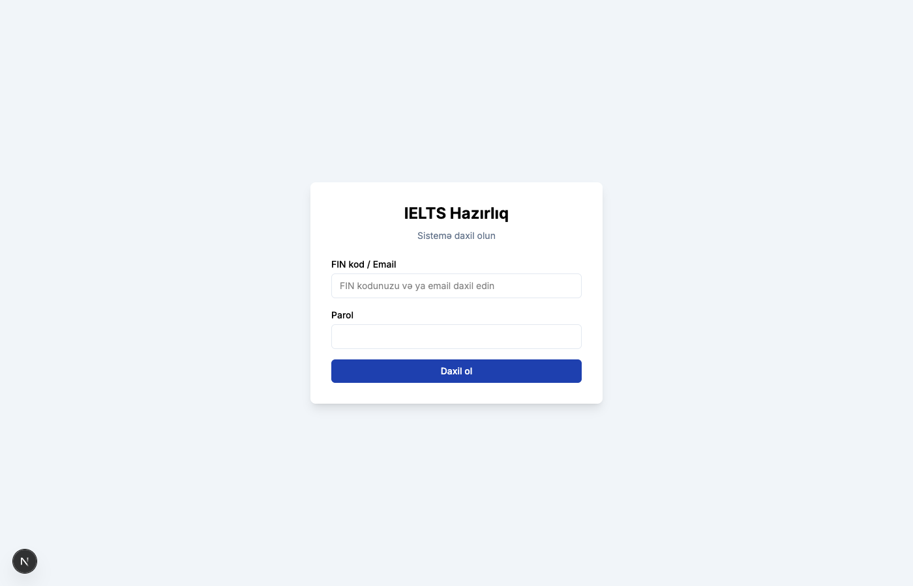
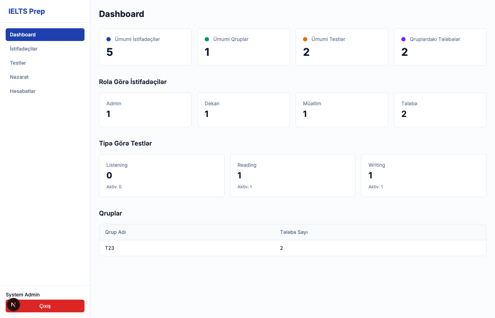
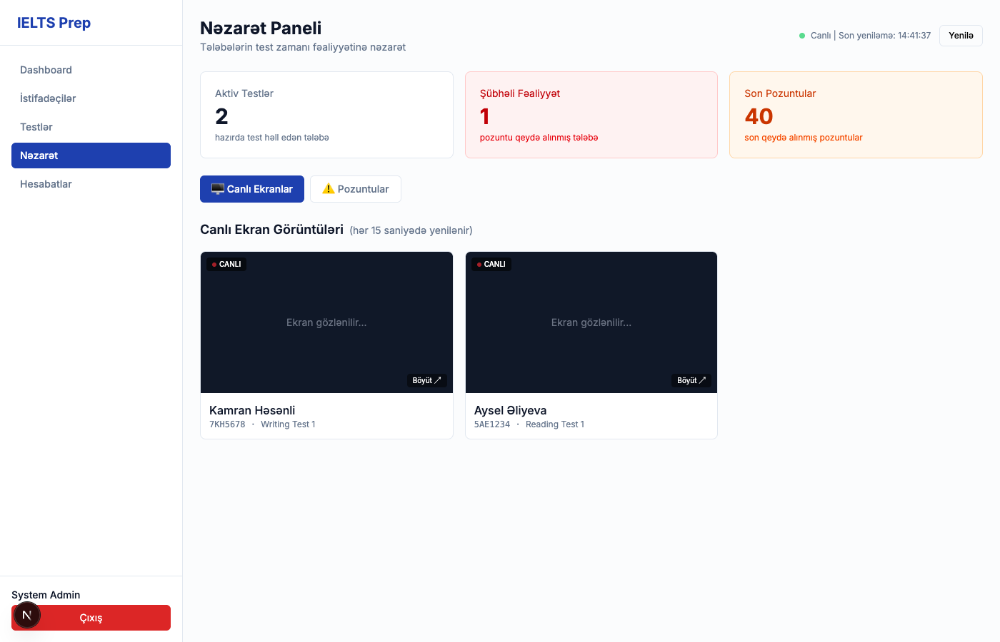
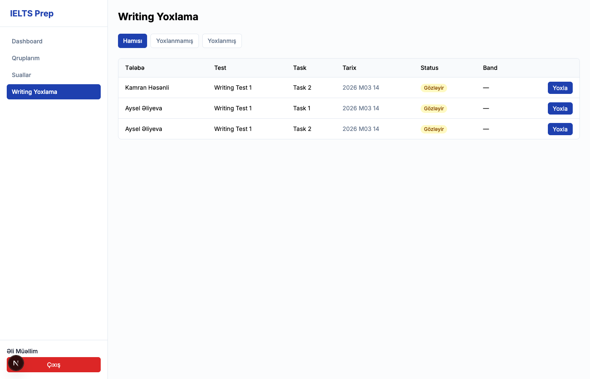
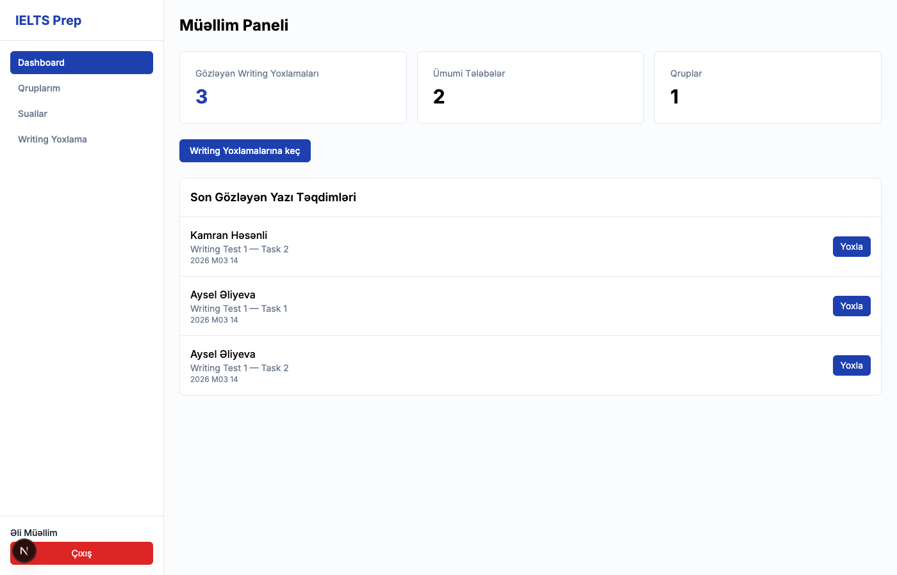

# IELTS Hazirliq Sistemi

Universitet ucun IELTS imtahan hazirliq platformasi.

## Xususiyyetler

**4 Rol:** Admin, Muellim, Telebe, Dekan

**Test Bolmeleri:**
- Listening - Audio dinleyib suallara cavab
- Reading - Metn oxuyub suallara cavab
- Writing - Esse yazma, muellim qiymetlendirmesi

**Sual Tipleri:** Multiple Choice, True/False/Not Given, Fill in the Blank, Note Completion, Matching, Sentence Completion

**Nezaret Sistemi (Proctoring):**
- Telebenin ekranina canli nezaret
- Tab deyishme, copy/paste ashkarlama
- Avtomatik screenshot (her 15 saniye + tab deyishme ani)
- Admin/Dekan canli ekran monitorinqi

**Diger:**
- FIN kodu ile giris
- Avtomatik cavab saxlama (localStorage)
- Telebe butun tapsiriqlari bitirmese cixish bloklahir
- Random test teyin etme
- Writing band score (Task Achievement, Coherence, Lexical Resource, Grammar)
- IIS deploy desteyi

## Texnologiyalar

- Next.js 16 (App Router)
- PostgreSQL + Prisma ORM
- NextAuth.js (JWT)
- Tailwind CSS
- TypeScript

## Qurashdrma

```bash
npm install
npx prisma db push
npm run db:seed
npm run dev
```

Ilkin giris: `admin@ielts.az` / `admin123`

## Ekran Goruntuleri

<p align="center">
  
  
</p>
<p align="center">
  
  
</p>
<p align="center">
  
  
</p>

## Demo Video

[Demo videoya baxin](docs/IELTS-Demo.mp4)

## Lisenziya

Bu layihe universitet daxili istifade ucun nezerde tutulub.
